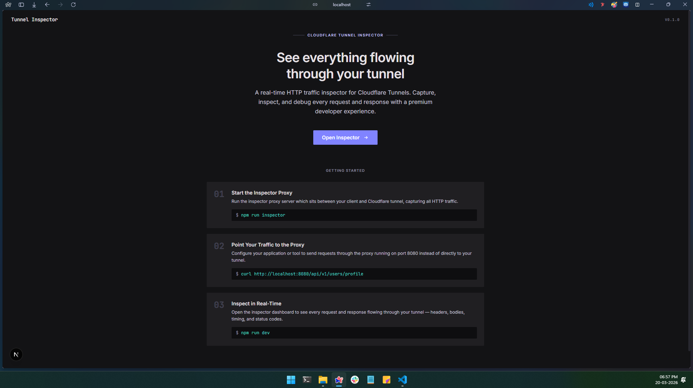
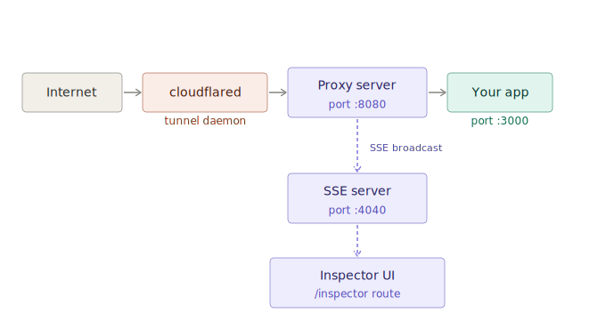
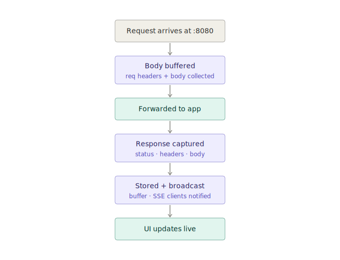
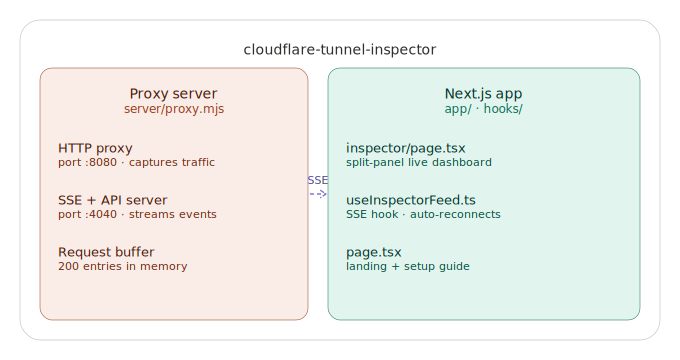
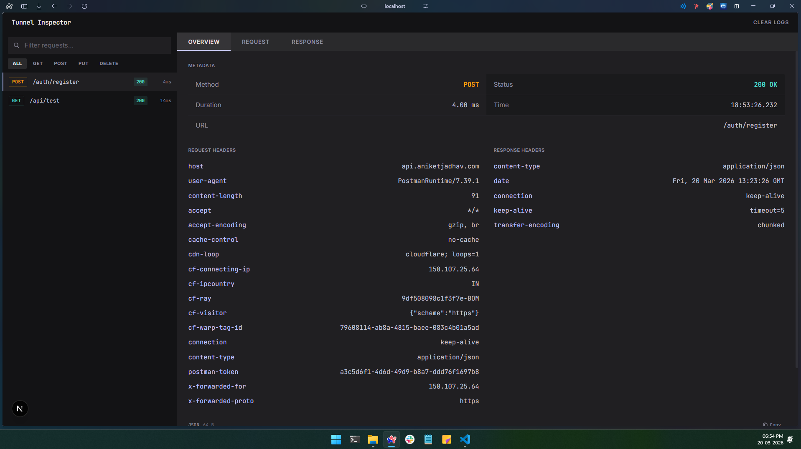
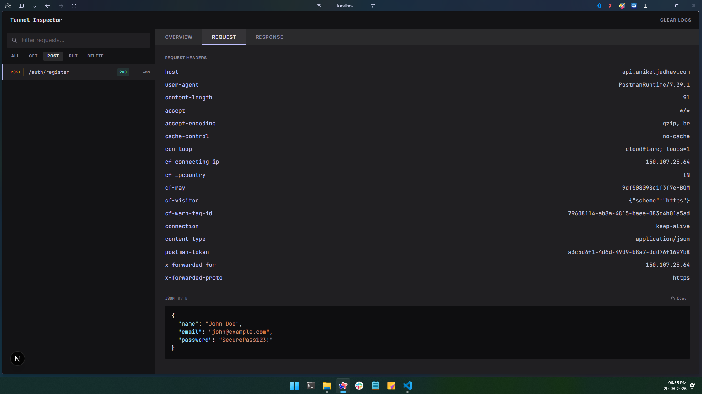
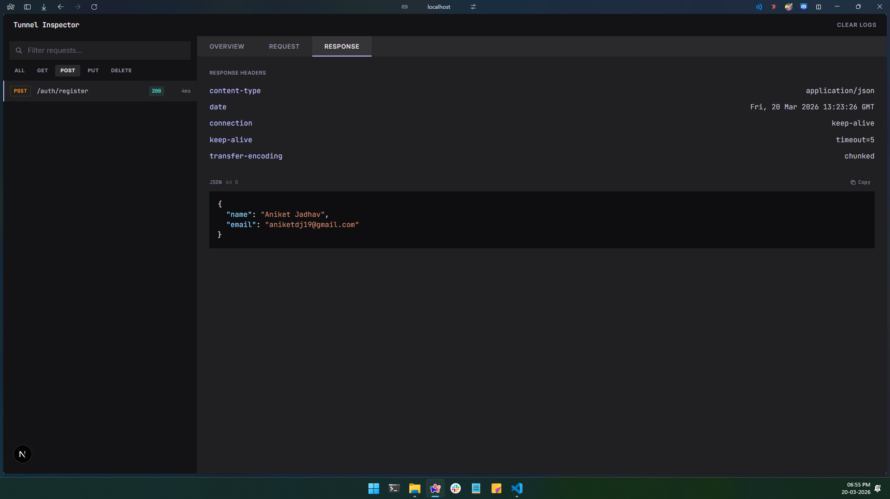

# Tunnel Inspector

A real-time HTTP traffic inspector for Cloudflare Tunnels. It works like ngrok's built-in inspector — but for `cloudflared`. A lightweight proxy sits between your tunnel and your app, captures every request/response pair, and streams them to a polished dark-themed dashboard.

> All traffic is inspected locally and never leaves your machine.



## How It Works

```
Internet → cloudflared → Proxy (:8080) → Your App (:3000)
                              ↓
                         SSE (:4040)
                              ↓
                      Inspector UI (:3000/inspector)
```

### Traffic flow
 
<p align="center">

</p>
 
### Request capture lifecycle
 
<p align="center">

</p>
 
### Project structure
 
<p align="center">

</p>

The proxy intercepts HTTP traffic on port **8080**, forwards it to your app on port **3000**, and broadcasts each request/response pair via Server-Sent Events on port **4040**. The Next.js inspector UI connects to the SSE stream and renders everything in real time.

## Quick Start

```bash
# Install dependencies
npm install

# Start both the Next.js dev server and the proxy
npm run dev:inspect
```

Open [http://localhost:3000](http://localhost:3000) to see the landing page, then click **Open Inspector** — or go directly to [http://localhost:3000/inspector](http://localhost:3000/inspector).

### Connect Cloudflare Tunnel

Point your `cloudflared` config to the proxy port instead of your app:

```yaml
# ~/.cloudflared/config.yml
tunnel: your-tunnel-id
credentials-file: ~/.cloudflared/your-tunnel-id.json

ingress:
  - hostname: yourdomain.com
    service: http://localhost:8080   # proxy port, not app port
  - service: http_status:404
```

Restart the tunnel:

```bash
cloudflared tunnel run your-tunnel-name
```

All tunnel traffic now flows through the inspector.

## Features

### Request List
- Live-updating feed of captured HTTP requests
- Color-coded method badges (GET, POST, PUT, DELETE, PATCH) using ghost-border styling
- Status code, URL path, and response duration at a glance
- Text search to filter by method or URL
- Method filter chips (All / GET / POST / PUT / DELETE)
- New requests animate in with a subtle fade
- Active selection highlighted with an indigo accent border

### Detail Inspector
Three tabs for each captured request:

**Overview**
- Metadata grid showing method, status, duration, timestamp, and full URL
- Side-by-side request and response headers
- Response body preview



**Request**
- Full request headers
- Request body with format-aware rendering



**Response**
- Full response headers
- Response body with format-aware rendering



### Body Viewer & Syntax Highlighting
The body viewer auto-detects content format and applies syntax highlighting:

| Format | Detection | Highlighting |
|---|---|---|
| **JSON** | `Content-Type` header or heuristic parse | Keys, strings, numbers, booleans, null — each with distinct colors |
| **HTML** | `Content-Type` or `<!DOCTYPE`/`<html` prefix | Tags (red), attributes (amber), attribute values (teal), comments (muted) |
| **XML** | `Content-Type` or `<?xml` prefix | Same as HTML |
| **JavaScript** | `Content-Type` header | Keywords (purple), strings/numbers (teal), types (amber), identifiers (blue), comments (muted) |
| **GraphQL** | `Content-Type` or query/mutation prefix | Keywords (purple), variables (amber), directives (purple), types (amber), strings (teal) |
| **GraphQL-over-JSON** | JSON body containing a `query` field | Splits into Operation, Query (with GraphQL highlighting), and Variables (with JSON highlighting) |
| **Form Data** | `Content-Type` or `key=value&` pattern | Decoded key-value pairs in a structured table |
| **Multipart** | `Content-Type` or `--boundary` prefix | Parsed parts with name, filename, content-type metadata |
| **Plain Text** | Fallback | Monospaced, no highlighting |

Every code block includes a **Copy** button with clipboard feedback.

### Landing Page
The root page (`/`) provides:
- Overview of what the inspector does
- Step-by-step getting started instructions with copyable terminal commands
- Direct link to the inspector dashboard

## Scripts

| Script | Description |
|---|---|
| `npm run dev` | Start the Next.js dev server on `:3000` |
| `npm run inspector` | Start the proxy server (`:8080` proxy, `:4040` SSE) |
| `npm run dev:inspect` | Start both concurrently |
| `npm run build` | Production build |
| `npm run start` | Start production server |
| `npm run lint` | Run ESLint |

## Architecture

### Proxy Server — `server/proxy.mjs`

A zero-dependency Node.js HTTP proxy using only the built-in `http` module:

- **Proxy** (`:8080`) — Receives requests, forwards to `localhost:3000`, captures the full request/response cycle including headers and bodies (auto-parsed as JSON when possible).
- **SSE/API** (`:4040`) — Two endpoints:
  - `GET /events` — SSE stream. Sends a `history` event with the full buffer on connect, then streams `response` events for each new request.
  - `GET /api/requests` — Returns the last 200 entries as JSON.

Entries are stored in a circular in-memory buffer capped at 200 items.

### Inspector UI — `app/inspector/page.tsx`

A single-page client component with a split-panel layout:

- **Left panel (380px)** — Request list with search, method filters, and selection state
- **Right panel (flex)** — Tabbed detail view (Overview / Request / Response)

Built with React 19, no external UI component dependencies for the inspector itself.

### SSE Hook — `hooks/useInspectorFeed.ts`

A React hook managing the SSE connection lifecycle:

- Connects to `http://localhost:4040/events`
- Handles `history` (bulk load) and `response` (single entry) events
- Auto-reconnects with a 3-second delay on disconnect
- Exposes `{ requests, connected, clear }`

### Landing Page — `app/page.tsx`

Getting started page with project overview, setup instructions, and a CTA to the inspector.

## Design System

The UI follows the **"Obsidian Lens"** design specification (see [DESIGN.md](DESIGN.md)):

- **Tonal Architecture** — Hierarchy through background color shifts, not borders
- **Surface Hierarchy** — Base (`#131315`) → Container (`#201f22`) → High (`#2a2a2c`) → Highest (`#353437`)
- **Dual Typefaces** — Inter for UI labels, JetBrains Mono for technical data
- **Ghost Borders** — 1px at 15-20% opacity for subtle separators
- **Semantic Method Colors** — GET (teal), POST (amber), PUT (blue), DELETE (red), PATCH (purple)
- **Sharp Corners** — `0.125rem` / `0.375rem` radii for a precise, engineered feel

## Tech Stack

- **Framework**: [Next.js 16](https://nextjs.org/) (App Router)
- **Language**: TypeScript
- **Styling**: [Tailwind CSS 4](https://tailwindcss.com/)
- **Runtime**: React 19
- **Proxy**: Node.js `http` module (zero dependencies)
- **Fonts**: Inter + JetBrains Mono (via `next/font/google`)

## Ports

| Port | Service |
|---|---|
| `3000` | Next.js dev server |
| `8080` | Proxy (point `cloudflared` here) |
| `4040` | SSE/API (inspector connects here) |

## Project Structure

```
├── app/
│   ├── page.tsx                # Landing page with instructions
│   ├── inspector/page.tsx      # Inspector dashboard
│   ├── layout.tsx              # Root layout (fonts, providers)
│   └── globals.css             # Design system tokens & theme
├── hooks/
│   └── useInspectorFeed.ts     # SSE connection hook
├── server/
│   └── proxy.mjs               # HTTP proxy + SSE server
├── components/ui/              # Shared UI primitives
├── DESIGN.md                   # Design system specification
└── package.json
```

## Limitations

- The proxy buffers full request and response bodies in memory. Very large payloads (file uploads, streaming responses) may cause high memory usage.
- Only HTTP traffic is captured. WebSocket upgrade requests are forwarded but not inspected.
- The circular buffer is in-memory only — restarting the proxy clears all captured data.
- All 200 buffered entries are sent to the browser; filtering is client-side only.

## Contributing

Contributions are welcome and encouraged! See [CONTRIBUTING.md](CONTRIBUTING.md) for setup instructions, coding guidelines, and ideas for what to work on.

Found a bug or have a suggestion? [Open an issue](../../issues) with a clear description and steps to reproduce.

## License

MIT
