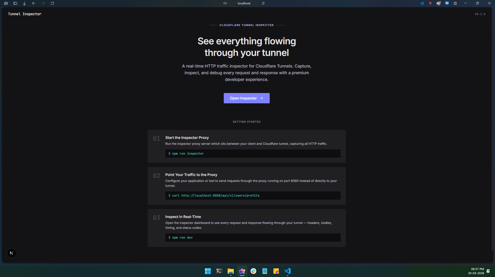
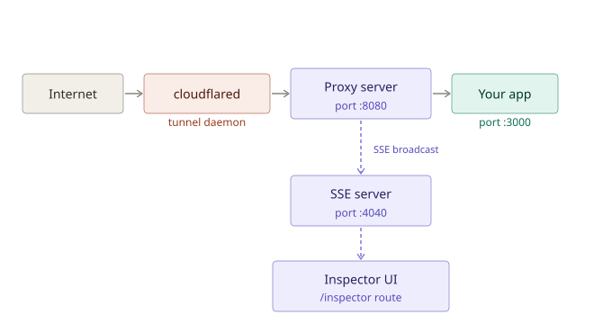
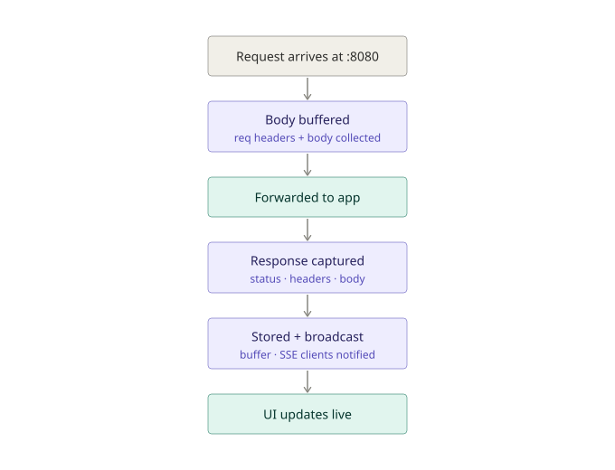
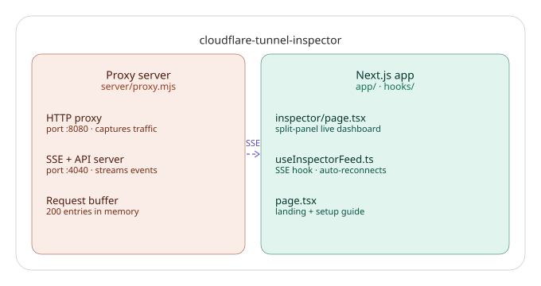
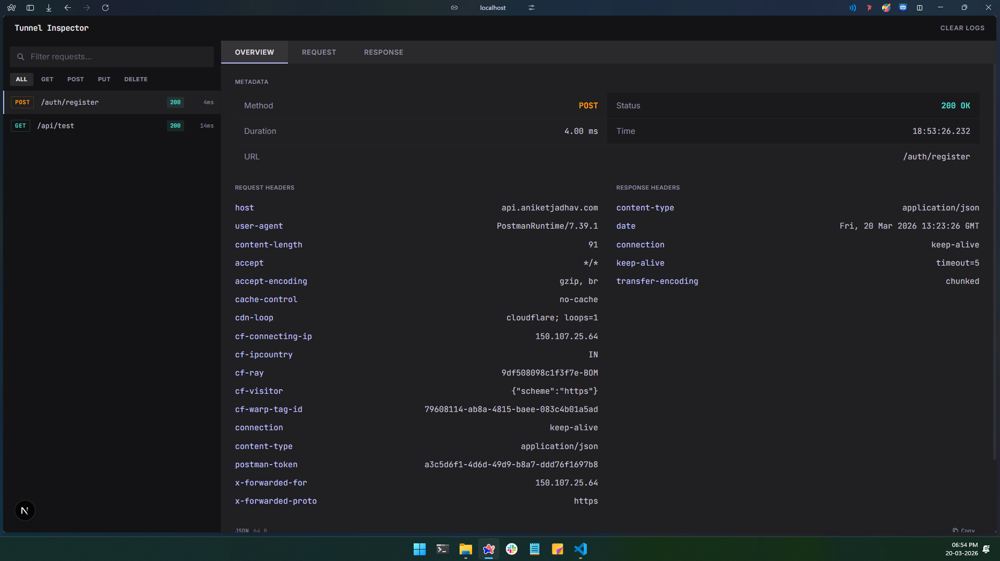
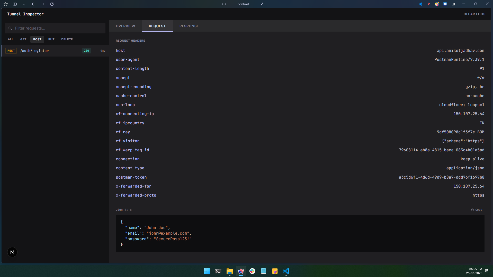
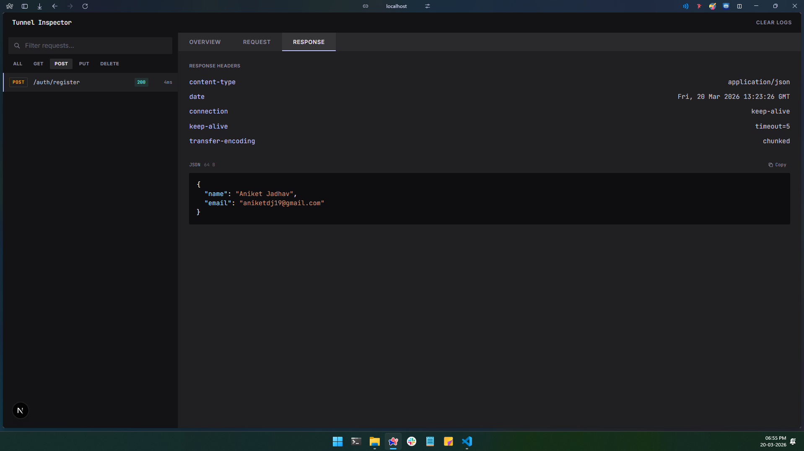

# Tunnel Inspector

A real-time HTTP traffic inspector for Cloudflare Tunnels. It works like ngrok's built-in inspector — but for `cloudflared`. A lightweight proxy sits between your tunnel and your app, captures every request/response pair, and streams them to a polished dark-themed dashboard.

> All traffic is inspected locally and never leaves your machine — the proxy and its API bind to loopback only, and sensitive headers can be redacted with `--redact`.



## How It Works

```
Internet → cloudflared → Proxy (:8080) → Your App (:3000)
                              ↓
                         SSE (:4040)
                              ↓
                      Inspector UI (:3001/inspector)
```

### Traffic flow

<p align="center">

</p>

### Request capture lifecycle

<p align="center">

</p>

### Project structure

<p align="center">

</p>

The proxy intercepts HTTP traffic on port **8080**, forwards it to your app on port **3000**, and broadcasts each request/response pair via Server-Sent Events on port **4040**. The Next.js inspector UI runs on port **3001**, connects to the SSE stream, and renders everything in real time.

Responses are **streamed straight through** — the proxy tees a copy into its capture buffer rather than holding the body until it completes, so SSE endpoints, chunked APIs, and large downloads behave exactly as they would without it. Every port is configurable; see [Configuration](#configuration).

## Quick Start

```bash
# Install dependencies
npm install

# Start both the Next.js dev server and the proxy
npm run dev:inspect
```

Open [http://localhost:3001](http://localhost:3001) to see the landing page, then click **Open Inspector** — or go directly to [http://localhost:3001/inspector](http://localhost:3001/inspector).

By default the proxy expects your app on `localhost:3000`. If it lives somewhere else:

```bash
npm run inspector -- --target-port 8000
```

### Connect Cloudflare Tunnel

Point your `cloudflared` config to the proxy port instead of your app:

```yaml
# ~/.cloudflared/config.yml
tunnel: your-tunnel-id
credentials-file: ~/.cloudflared/your-tunnel-id.json

ingress:
  - hostname: yourdomain.com
    service: http://localhost:8080   # proxy port, not app port
  - service: http_status:404
```

Restart the tunnel:

```bash
cloudflared tunnel run your-tunnel-name
```

All tunnel traffic now flows through the inspector.

## Features

### Request List

- Live-updating feed of captured HTTP requests
- Color-coded method badges (GET, POST, PUT, DELETE, PATCH) using ghost-border styling
- Status code, URL path, and response duration at a glance
- Text search to filter by method, URL, or status code
- Method filter chips (All / GET / POST / PUT / PATCH / DELETE)
- Status class chips (All / 2xx / 3xx / 4xx / 5xx)
- Query strings shown alongside the path, dimmed
- WebSocket upgrades listed with a `WS` badge; replayed requests marked with an arrow
- Search and filter selections persist across reloads
- New requests animate in with a subtle fade
- Active selection highlighted with an indigo accent border

### Detail Inspector

Three tabs for each captured request:

**Overview**

- Metadata grid showing method, status, duration, TTFB, transferred size, timestamp, and full URL
- Side-by-side request and response headers
- Response body preview

Each request also has two actions in the tab bar:

- **Replay** — re-sends the request through the proxy, so the replay is captured too and shows up in the feed marked as replayed
- **Copy as cURL** — a runnable command aimed at the proxy, so terminal replays are captured as well



**Request**

- Full request headers
- Request body with format-aware rendering



**Response**

- Full response headers
- Response body with format-aware rendering



### Body Viewer & Syntax Highlighting

The body viewer auto-detects content format and applies syntax highlighting:

| Format                      | Detection                                          | Highlighting                                                                                     |
| --------------------------- | -------------------------------------------------- | ------------------------------------------------------------------------------------------------ |
| **JSON**              | `Content-Type` header or heuristic parse         | Keys, strings, numbers, booleans, null — each with distinct colors                              |
| **HTML**              | `Content-Type` or `<!DOCTYPE`/`<html` prefix | Tags (red), attributes (amber), attribute values (teal), comments (muted)                        |
| **XML**               | `Content-Type` or `<?xml` prefix               | Same as HTML                                                                                     |
| **JavaScript**        | `Content-Type` header                            | Keywords (purple), strings/numbers (teal), types (amber), identifiers (blue), comments (muted)   |
| **GraphQL**           | `Content-Type` or query/mutation prefix          | Keywords (purple), variables (amber), directives (purple), types (amber), strings (teal)         |
| **GraphQL-over-JSON** | JSON body containing a`query` field              | Splits into Operation, Query (with GraphQL highlighting), and Variables (with JSON highlighting) |
| **Form Data**         | `Content-Type` or `key=value&` pattern         | Decoded key-value pairs in a structured table                                                    |
| **Multipart**         | `Content-Type` or `--boundary` prefix          | Parsed parts with name, filename, content-type metadata                                          |
| **Plain Text**        | Fallback                                           | Monospaced, no highlighting                                                                      |

Every code block includes a **Copy** button with clipboard feedback.

Bodies the proxy cannot usefully show as text are handled explicitly rather than rendered as mojibake:

- **Compressed** responses (`gzip`, `deflate`, `br`, `zstd`) are decoded for display while the client still receives the original bytes.
- **Binary** payloads (images, archives, anything with a NUL byte) show a placeholder with their content type and size.
- **Oversized** bodies are captured up to `--max-body-bytes` (256 KB by default) and flagged as truncated, so a large download never sits in memory in full.
- **Redacted** headers show as `redacted` instead of their value.

### Landing Page

The root page (`/`) provides:

- Overview of what the inspector does
- Step-by-step getting started instructions with copyable terminal commands
- Direct link to the inspector dashboard

## Scripts

| Script                  | Description                                                 |
| ----------------------- | ----------------------------------------------------------- |
| `npm run dev`         | Start the Next.js dev server on`:3001`                    |
| `npm run inspector`   | Start the proxy server (`:8080` proxy, `:4040` SSE/API) |
| `npm run mcp` | Start the MCP server for AI agents (stdio) |
| `npm run dev:inspect` | Start both concurrently                                     |
| `npm run build`       | Production build                                            |
| `npm run start`       | Start the production server on`:3001`                     |
| `npm run lint`        | Run ESLint                                                  |
| `npm run typecheck`   | Run`tsc --noEmit`                                         |
| `npm test`            | Run the test suite once                                     |
| `npm run test:watch`  | Run the tests in watch mode                                 |

Flags go to the proxy after `--`, e.g. `npm run inspector -- --target-port 8000 --redact`.

## Configuration

Every proxy setting can be given as a CLI flag or an environment variable; flags win. Copy [`.env.example`](.env.example) to `.env` to set them persistently.

| Flag                 | Env                | Default        | Description                                    |
| -------------------- | ------------------ | -------------- | ---------------------------------------------- |
| `--target-host`    | `TARGET_HOST`    | `127.0.0.1`  | Host your app listens on                       |
| `--target-port`    | `TARGET_PORT`    | `3000`       | Port your app listens on                       |
| `--proxy-host`     | `PROXY_HOST`     | `127.0.0.1`  | Interface the proxy binds                      |
| `--proxy-port`     | `PROXY_PORT`     | `8080`       | Port`cloudflared` should point at            |
| `--inspector-host` | `INSPECTOR_HOST` | `127.0.0.1`  | Interface the SSE/API server binds             |
| `--inspector-port` | `INSPECTOR_PORT` | `4040`       | SSE/API port                                   |
| `--max-entries`    | `MAX_ENTRIES`    | `200`        | Entries kept in the ring buffer                |
| `--max-body-bytes` | `MAX_BODY_BYTES` | `262144`     | Bytes captured per body before truncating      |
| `--redact`         | `REDACT_HEADERS` | *(off)*      | Headers to hide from the feed                  |
| `--allow-origin`   | `ALLOW_ORIGIN`   | *(loopback)* | Extra browser origins allowed to read the API  |
| `--rewrite-host`   | `REWRITE_HOST`   | `false`      | Send the target's Host instead of the tunnel's |

The UI reads `NEXT_PUBLIC_INSPECTOR_URL` (default `http://localhost:4040`) to find the API.

### Redaction

Bare `--redact` hides `authorization`, `proxy-authorization`, `cookie`, `set-cookie`, `x-api-key`, and `x-auth-token`. Pass a comma-separated list to choose your own:

```bash
npm run inspector -- --redact authorization,cookie,x-session
```

Redaction happens **before** an entry enters the buffer, so the secret never reaches the SSE stream, the API, or the UI. The real header is still forwarded to your app untouched — only the inspector's copy is masked, which makes the dashboard safe to screen-share.

Because the inspector never holds the real value, **Replay** and **Copy as cURL** leave redacted headers out entirely rather than sending the placeholder — the cURL command notes which ones it dropped so you can supply them yourself.

### Binding and origins

Both servers bind `127.0.0.1` by default, and the API refuses browser requests from any non-loopback origin. Captured traffic — including auth headers — is not reachable from the rest of your network unless you deliberately widen `--proxy-host`, `--inspector-host`, or `--allow-origin`.

## MCP server — give AI agents the traffic

An agent debugging a webhook shouldn't need you to paste JSON at it. `server/mcp.mjs` is a
[Model Context Protocol](https://modelcontextprotocol.io) server that exposes the capture buffer
to any MCP client — Claude Code, Claude Desktop, Cursor, or your own.

```bash
npm run inspector    # the proxy must be running
npm run mcp          # the MCP server, over stdio
```

It is a client of the inspector's HTTP API rather than part of the proxy process, so the proxy
stays dependency-free and either side can restart without the other noticing.

### Tools

| Tool | Description |
|---|---|
| `list_requests` | Captured requests, newest first, without bodies. Filter by `method`, `status` (`404` or `4xx`), `search`, `limit` |
| `get_request` | Full detail for one entry: both sets of headers and bodies, clipped for context |
| `get_stats` | Counts by method and status class, error and replay counts, p50/p95/max timing, slowest five |
| `replay_request` | Re-sends a captured request through the proxy so the agent can verify a fix |
| `clear_requests` | Empties the buffer — useful before reproducing an issue |

`inspector://config` is exposed as a resource, so a client can read the ports, capture limits,
and redaction state without spending a tool call.

Read tools are annotated `readOnlyHint`, `clear_requests` is `destructiveHint`, and every tool is
`openWorldHint: false` — clients that gate on annotations will treat them correctly.

### Connecting a client

Copy [`.mcp.json.example`](.mcp.json.example) to `.mcp.json` in the project root (Claude Code picks
it up automatically), or add the same block to your client's config:

```json
{
  "mcpServers": {
    "tunnel-inspector": {
      "command": "node",
      "args": ["server/mcp.mjs"],
      "env": { "INSPECTOR_URL": "http://127.0.0.1:4040" }
    }
  }
}
```

Use an absolute path to `server/mcp.mjs` for clients that don't run from the project directory.
`--inspector-url` works as a flag too, if you moved the inspector off `:4040`.

### What agents see

Redaction applies here as it does everywhere else: headers hidden by `--redact` reach the agent as
`«redacted»`, never as the real value, and `replay_request` drops them rather than sending the
placeholder — so an authenticated request may replay as a 401. Bodies are clipped to 4 KB per side
before they reach the model, and binary bodies are described rather than dumped.

Everything stays on localhost. The MCP server talks only to your inspector, and the inspector only
to your app.

## Architecture

### Proxy Server — `server/proxy.mjs`

A zero-dependency Node.js HTTP proxy using only built-in modules, split into three files:

- `server/proxy.mjs` — the two servers and the request/upgrade handling
- `server/config.mjs` — flag/env resolution and the origin allowlist
- `server/capture.mjs` — body collection, decompression, binary sniffing, redaction

**Proxy** (`:8080`) — Forwards requests to the target and pipes responses back as they arrive, teeing a capped copy into the capture buffer. `Host` is preserved by default and `X-Forwarded-For` / `-Proto` / `-Host` are added. WebSocket and other protocol upgrades are proxied end to end and logged as `101` entries.

**SSE/API** (`:4040`):

| Endpoint              | Description                                                                                                                                                       |
| --------------------- | ----------------------------------------------------------------------------------------------------------------------------------------------------------------- |
| `GET /events`       | SSE stream: a`history` event with the full buffer on connect, a `response` event per capture, and a comment heartbeat every 20s so idle connections stay open |
| `GET /api/requests` | The buffer as JSON                                                                                                                                                |
| `GET /api/config`   | Resolved ports, limits, and redaction state                                                                                                                       |
| `POST /api/replay`  | Re-sends`{ method, url, headers, body }` through the proxy                                                                                                      |
| `DELETE /api/clear` | Empties the buffer and broadcasts an empty`history`                                                                                                             |

Entries are stored in a circular in-memory buffer capped at `--max-entries` items.

### MCP Server — `server/mcp.mjs`

A separate stdio process that reads the inspector API and exposes it to MCP clients.
It is the only part of the repo with runtime dependencies. See
[MCP server](#mcp-server--give-ai-agents-the-traffic) above for the tools it provides.

### Inspector UI — `app/inspector/page.tsx`

A single-page client component with a split-panel layout:

- **Left panel (380px)** — Request list with search, method filters, and selection state
- **Right panel (flex)** — Tabbed detail view (Overview / Request / Response)

Built with React 19, no external UI component dependencies for the inspector itself.

### SSE Hook — `hooks/useInspectorFeed.ts`

A React hook managing the SSE connection lifecycle:

- Connects to `NEXT_PUBLIC_INSPECTOR_URL` (default `http://localhost:4040/events`)
- Handles `history` (bulk load) and `response` (single entry) events
- Reconnects with exponential backoff (1s to 30s), cancelled cleanly on unmount
- Exposes `{ requests, connected, config, clear, replay }`

### Landing Page — `app/page.tsx`

Getting started page with project overview, setup instructions, and a CTA to the inspector.

## Design System

The UI follows the **"Obsidian Lens"** design specification (see [DESIGN.md](DESIGN.md)):

- **Tonal Architecture** — Hierarchy through background color shifts, not borders
- **Surface Hierarchy** — Base (`#131315`) → Container (`#201f22`) → High (`#2a2a2c`) → Highest (`#353437`)
- **Dual Typefaces** — Inter for UI labels, JetBrains Mono for technical data
- **Ghost Borders** — 1px at 15-20% opacity for subtle separators
- **Semantic Method Colors** — GET (teal), POST (amber), PUT (blue), DELETE (red), PATCH (purple)
- **Sharp Corners** — `0.125rem` / `0.375rem` radii for a precise, engineered feel

## Tech Stack

- **Framework**: [Next.js 16](https://nextjs.org/) (App Router)
- **Language**: TypeScript
- **Styling**: [Tailwind CSS 4](https://tailwindcss.com/)
- **Runtime**: React 19
- **Proxy**: Node.js `http` module (zero dependencies)
- **Agent access**: [MCP](https://modelcontextprotocol.io) via `@modelcontextprotocol/sdk` (used only by `server/mcp.mjs`)
- **Fonts**: Inter + JetBrains Mono (via `next/font/google`)

## Ports

| Port     | Service                                |
| -------- | -------------------------------------- |
| `3001` | Next.js dev server (the inspector UI)  |
| `3000` | Your app — the proxy's default target |
| `8080` | Proxy (point`cloudflared` here)      |
| `4040` | SSE/API (the UI connects here)         |

All of these are configurable; see [Configuration](#configuration).

## Project Structure

```
├── app/
│   ├── page.tsx                # Landing page with instructions
│   ├── inspector/page.tsx      # Inspector dashboard
│   ├── layout.tsx              # Root layout (fonts, providers)
│   └── globals.css             # Design system tokens & theme
├── hooks/
│   └── useInspectorFeed.ts     # SSE connection hook
├── server/
│   ├── proxy.mjs               # HTTP proxy + SSE/API servers
│   ├── config.mjs              # Flag/env resolution, origin allowlist
│   ├── capture.mjs             # Body capture, decoding, redaction
│   └── mcp.mjs                 # MCP server for AI agents
├── tests/                      # Vitest unit + proxy integration tests
├── components/ui/              # Shared UI primitives
├── .env.example                # Documented configuration
├── DESIGN.md                   # Design system specification
└── package.json
```

## Limitations

- WebSocket upgrades are proxied end to end and logged, but individual frames are not decoded or shown.
- Bodies are captured up to `--max-body-bytes`; anything past that is counted and flagged as truncated rather than stored.
- Binary bodies are identified and sized, not rendered.
- The circular buffer is in-memory only — restarting the proxy clears all captured data.
- The whole buffer is sent to the browser; filtering is client-side only.
- HTTP/1.1 only, over plain HTTP to the target. `cloudflared` terminates TLS before the proxy, which is the intended setup.

## Testing

```bash
npm test          # unit + integration
npm run typecheck
npm run lint
```

The suite covers configuration resolution, body capture (truncation, gzip/brotli decoding, binary sniffing, redaction), and the UI helpers. Two integration suites go further: one boots the real proxy against a fake upstream and asserts streaming, compression passthrough, 502 handling, redaction, WebSocket upgrades, replay, and the API surface; the other drives the MCP server through a real MCP client over stdio. CI runs all of it on every push and pull request.

## Versioning and releases

Semantic versioning, automated by [release-please](https://github.com/googleapis/release-please).
The public surface that versioning promises are made about is:

- the proxy's CLI flags and environment variables
- the default ports
- the SSE/API contract and the shape of a capture entry
- the MCP tool names and their arguments

Changing any of those is breaking. UI restyling and internal refactors are not.

While the project is below `1.0`, breaking changes bump the **minor** (`0.1` → `0.2`) and everything
else the patch. `1.0.0` is the point at which those flags and endpoints are held stable.

### How a release happens

Commit messages drive it, so they need to follow
[Conventional Commits](https://www.conventionalcommits.org/):

| Commit prefix | Effect |
|---|---|
| `fix:` | patch bump, listed under Bug Fixes |
| `feat:` | minor bump, listed under Features |
| `feat!:` or `BREAKING CHANGE:` in the body | minor bump while below 1.0, flagged as breaking |
| `docs:` `refactor:` `perf:` | listed, no bump on their own |
| `chore:` `ci:` `test:` `build:` | hidden from the changelog |

On every push to `master`, the release workflow opens (or updates) a PR titled
`chore(master): release X.Y.Z` containing the version bumps and a generated `CHANGELOG.md`.
Merging that PR tags the release and publishes it on GitHub. Nothing is versioned by hand.

The version is read from `package.json` in one place and surfaced in four: the proxy's startup
banner, `GET /api/config`, the inspector header, and the landing page footer. A test asserts the
served version matches `package.json`, so they cannot drift.

> First-time setup: in GitHub, Settings → Actions → General → Workflow permissions, enable
> **"Allow GitHub Actions to create and approve pull requests"**, or the workflow cannot open its
> release PR.

## Contributing

Contributions are welcome and encouraged! See [CONTRIBUTING.md](CONTRIBUTING.md) for setup instructions, coding guidelines, and ideas for what to work on.

Found a bug or have a suggestion? [Open an issue](../../issues) with a clear description and steps to reproduce.

## License

MIT
